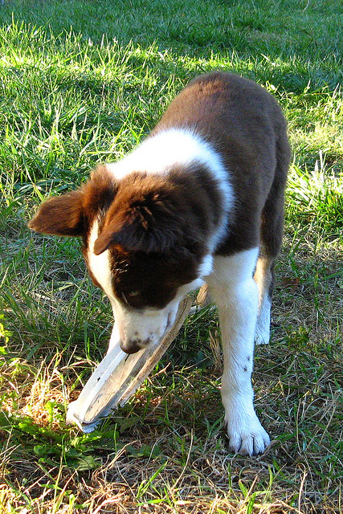

# Analysis of MSCOCO images with nodes from VisualSem
# Using 1000D representations and cosine similarity

## Top-N Frequency Plots

### Top-1

### Top-5

### Top-10

### Top-50

### Summary
As we can see from the above frequency plots, the more nodes we gather per image, the more the line becomes more horizontal instead of decreasing exponentially. Moreover, using the top-1 shows much more what can be expected in the MSCOCO images (zebra, ice-dancing etc.) compared to the top-50 that becomes slightly more random due to more abstract recognized nodes. Still not great.   

## Examples
To show whether the representations are useful and correct things can be recognized in an image, the MSCOCO images are shown with the recognized nodes in order.

### Example 1

COCO_train2014_000000046114.jpg

['Nokia', 'blue_Screen_of_Death', 'Touchpad', 'mobile_phone', 'PowerBook', 'pager', 'Amstrad_CPC', 'Automotive_navigation_system', 'Acer_Inc.', 'IPhone', 'webcam', 'floppy_disk', 'IPhone_(1st_generation)', 'Dell_Latitude', 'laptop', 'home_computer', 'microcomputer', 'Global_Positioning_System', 'Mac_Mini', 'Game_Boy', 'Apple_Newton', 'Wii_Remote', 'Game_Boy_Advance', 'autopilot', '2B1', 'typewriter', 'Eighth_generation_of_video_game_consoles', 'USB', 'Brother_Industries', 'peripheral', 'tacheometer', 'History_of_personal_computers', 'Fourth_generation_of_video_game_consoles', 'Nokia_Nseries', 'radio-frequency_identification', 'MacBook', 'phone', 'modem', 'industrial_design', 'braille', 'Macintosh_Quadra', 'Game.com', 'adding_machine', 'Triumph-Adler', 'Seventh_generation_of_video_game_consoles', 'USB_3.0', 'Form_factor_(mobile_phones)', 'Clive_Sinclair', 'smartphone', 'Computer_terminal']

### Example 2

COCO_train2014_000000211852.jpg

['papillon', 'Companion_dog', 'Japanese_spaniel', 'Saint_Bernard', 'spitz', 'sheep_dog', 'Australian_Shepherd', 'Spaniel', 'puppy', 'collie', 'Bernese_Mountain_Dog', 'Chihuahua', 'Chinese_Crested_Dog', 'Shetland_sheepdog', 'Phalène', 'corgi', 'rough_Collie', 'toy_dog', 'Boston_Terrier', 'Pekingese', 'Laika_(dog_breed)', 'wire_Fox_Terrier', 'Lapponian_Herder', 'chow_chow', 'border_Collie', 'English_springer_spaniel', 'Welsh_Corgi', 'toy_poodle', 'beagle', 'Cardigan', 'Stabyhoun', 'PBGV', 'springer', 'Non-sporting_group', 'Dog_breed', 'Chiweenie', 'chowchow', 'Akita_(dog)', 'Nordic_hunting_spitz', 'Herding_spitz', 'Flushing_dog', 'terrier', 'dog', 'Mountain_dog', 'Shih-Tzu', 'standard_poodle', 'Afghan_Hound', 'Entlebucher_Mountain_Dog', 'basset', 'Pomeranian']

### Example 3

COCO_train2014_000000445140.jpg

['Aureus', 'Pollicipes_pollicipes', 'gigot', 'Octopus_(genus)', 'electrum', 'sea_slug', 'oyster', 'Rocky_road_(dessert)', 'demosponge', 'food_fish', 'larb', 'artichoke', 'Mollusca', 'Morchella_esculenta', 'barnacle', 'durian', 'horse-chestnut', 'cinnamon_stone', 'Bollito_Misto', 'horseshoe_crab', 'Chanpurū', 'hyperbolic_geometry', 'shiitake', 'crab', '145_BC', 'Caridea', 'chow_mein', 'Nephrops_norvegicus', 'globe_amaranth', 'Menippe', 'small_giant_clam', 'welwitschia', 'giant_clam', 'Arceuthobium', 'spiny_lobster', 'octopus', 'Haliotis', 'chiton', 'caper', 'Erysimum_cheiri', 'shellfish', 'shrimp', 'Dungeness_crab', 'crustacean', 'Brachyura', 'truffle', 'Polyporus', 'Armillaria', 'linseed', 'Easter_bread']

### Example 4

COCO_train2014_000000574696.jpg

["Grant's_zebra", 'quagga', 'zebra', "Burchell's_zebra", 'Holstein', 'Equidae', 'mountain_zebra', 'Equus_grevyi', 'American_Paint_Horse', 'okapi', 'Horse_gait', "Burchell's_zebra", 'Gypsy_Cob', 'equid', 'trot', 'Arabian_horse', 'Belgian_Blue', 'cow_pony', 'Equus', 'stallion', 'Brown_Swiss', 'Clydesdale', 'Vosgienne', 'shire_horse', 'Lipizzan', 'Equine_coat_color', 'Normande', "Hartmann's_mountain_zebra", 'Trakehner', 'Welsh_cob', 'Welsh_pony', 'purebred', 'horse', 'Tail_(horse)', 'Montbéliarde', 'Percheron', 'dalmatian', "Crawshay's_zebra", 'Warmblood', 'Ardennes_horse', 'Hinterwald', "Chapman's_zebra", 'saddle_horse', 'horseback_riding', 'Appaloosa', 'quadruped', 'Rollkur', 'dun', 'cattle', 'Cattle_feeding']

### Summary
Some things are recognized well, but there are still some mistakes. Here, we can also see that in the first few comparisons, we can see that those are mostly the most accurate. This looks better than the 2048D.

## Cosine Similarities
To see how the cosine similarities relate to each other in the top-Ns, we show some mean, median, variance and both min and max statistics. F stands for gathering all the similarities for that top and applying the statistics, whereas P calculates these statistics per image top and then averaging this.

|        |  Mean F |  Median F |  Variance F x 10^-6 |  Mean P |  Median P |  Variance P x 10^-8 |  Min F |  Max F |
|--------|---------|-----------|---------------------|---------|-----------|----------------------|--------|--------|
| Top-1  | 0.995   | 0.995     | 1.909               | 0.995   | 0.995     | 0                    | 0.983  | 0.997  |
| Top-5  | 0.994   | 0.995     | 2.111               | 0.994   | 0.994     | 1.784                | 0.981  | 0.997  |
| Top-10 | 0.994   | 0.995     | 2.236               | 0.994   | 0.994     | 2.366                | 0.981  | 0.997  |
| Top-50 | 0.994   | 0.995     | 2.619               | 0.994   | 0.994     | 4.0                  | 0.979  | 0.997  |

### Summary
What we can see, is that for all the tops, both the mean and medians don't differ significantly, however, we can see a growing variance as soon as more nodes are introduced as well as lower possible values.
