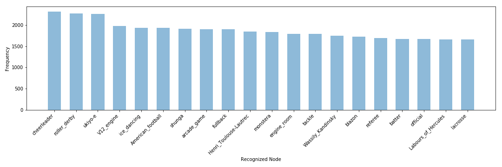

# Analysis of MSCOCO images with nodes from VisualSem
# Using 1000D representations and l1

## Top-N Frequency Plots

### Top-1

### Top-5

### Top-10

### Top-50

### Summary
As we can see from the above frequency plots, it does not follow the curve you would expect. Some concepts look as expected.

## Examples
To show whether the representations are useful and correct things can be recognized in an image, the MSCOCO images are shown with the recognized nodes in order.

### Example 1

COCO_train2014_000000046114.jpg

['corrugated_board', 'LGA_775', 'Электроника_МК-90', 'Parallel_ATA', 'cube', 'cabin', 'Alienware', 'Car_phone', 'Intel_Atom', 'host', 'MSX', 'Network-attached_storage', 'table_saw', 'Russian_avant-garde', 'back', 'Nvidia', 'encephalogram', 'P6_(microarchitecture)', 'blackboard', 'Vannevar_Bush', 'loveseat', 'serigraphy', 'integrated_circuit', 'Beta_distribution', 'handbag', 'silkscreen', 'Omri', 'virtual_reality', 'police_box', 'file_folder', 'field_ration', 'Handheld_PC', 'Rhodes_piano', 'Medical_glove', 'washboard', 'Linux', 'digital_computer', 'hospital_room', 'toilet_paper', 'Mattel_Aquarius', 'Filter_press', 'disc_jockey', 'HP_200LX', 'Compiz', 'PC_board', 'mailbag', 'turnstile', 'Land_grid_array', 'Cajón', 'diacritic']

### Example 2

COCO_train2014_000000211852.jpg

['house_mouse', 'Laboratory_mouse', 'fancy_rat', 'Roborovski_hamster', 'caterwaul', 'albinism', 'Narcissistic_personality_disorder', 'Southern_short-tailed_shrew', 'calico_cat', 'Manx_cat', 'pet', 'fur', 'hamster', 'bruise', 'black_eye', 'Birman', 'scabies', 'Oriental_Shorthair', 'Jaroslav_Drobný', 'Far_Eastern_Krai', 'potto', 'eye_color', 'Nikolay_Lossky', 'guinea_pig', 'syphilis', 'Cornish_Rex', 'Angora_rabbit', 'mutation', 'Sphynx', 'domestic_rabbit', 'Transition_to_the_New_Order', 'hair', 'Devon_Rex', 'pocket_rat', 'Ipomoea_leptophylla', 'pansy', 'Vinca', 'orgy', 'Periorbital_puffiness', 'Turkish_Van', 'cat', 'jaundice', 'Evolution_of_mammals', 'esophagogastric_junction', 'Rubia_cordifolia', 'Chief_Justice_of_the_Supreme_Court_of_Hong_Kong', 'nematode', 'kitten', 'Model_organism', 'glia']

### Example 3

COCO_train2014_000000445140.jpg

['Vegetarian_cuisine', 'Thai_cuisine', 'appetizer', 'seafood', 'food_fish', 'sushi', 'Cuisine_of_Franche-Comte', 'steak_tartare', 'rollmops', 'Malaysian_cuisine', 'salad', 'smorgasbord', 'Vietnamese_cuisine', 'Smørrebrød', 'open_sandwich', 'European_cuisine', 'pork', 'ham', 'Green_papaya_salad', 'tofu', 'confectionery', 'amber', 'spice', 'sandwich', "hors_d'oeuvre", 'sour_cream', 'dill_pickle', 'charcuterie', 'taco', 'gyro', 'bean', 'pitahaya', 'ptomaine', 'cayenne_pepper', 'Nephrops_norvegicus', 'rojak', 'Sichuan_cuisine', 'king_cake', 'pasta_salad', 'pasta', 'English_cuisine', 'tiramisu', 'corn_smut', 'antipasto', 'tamale', 'food', 'dinner', 'oolong', 'noodle', 'liver']

### Example 4

COCO_train2014_000000574696.jpg

['Equidae', 'American_Paint_Horse', "Grant's_zebra", 'quagga', 'stallion', 'Horse_gait', 'equid', 'racer', 'okapi', 'Arabian_horse', 'Warmblood', 'zebra', 'Equus_grevyi', "Burchell's_zebra", 'Gypsy_Cob', 'Clydesdale', 'Equine_coat_color', 'purebred', 'shire_horse', 'dun', 'Equus', "Crawshay's_zebra", 'cow_pony', 'Welsh_pony', 'mountain_zebra', 'Percheron', 'Belgian_Blue', 'Flaxen_gene', 'gelding', 'horse', 'Horse_markings', 'Falabella', "Burchell's_zebra", 'horse_breeding', 'canter', 'Trakehner', 'Kabarda_horse', 'Holstein', 'dalmatian', 'Valmiki_National_Park', 'Tail_(horse)', 'buckskin', 'odd-toed_ungulate', 'Silver_dapple_gene', 'Bengal_tiger', 'American_saddle_horse', 'trot', 'filly', 'Great_Dane', 'attack_dog']

### Summary
This clearly shows that things are recognized correctly for each of these images. This indicates that l2 does not capture differences good enough compared  to cosine similarity for the 2048D.

## Cosine Similarities
To see how the cosine similarities relate to each other in the top-Ns, we show some mean, median, variance and both min and max statistics. F stands for gathering all the similarities for that top and applying the statistics, whereas P calculates these statistics per image top and then averaging this.

<table border="1" class="dataframe">
  <thead>
    <tr style="text-align: right;">
      <th></th>
      <th>Mean F</th>
      <th>Median F</th>
      <th>Variance F</th>
      <th>Mean P</th>
      <th>Median P</th>
      <th>Variance P</th>
      <th>Min F</th>
      <th>Max F</th>
    </tr>
  </thead>
  <tbody>
    <tr>
      <th>Top-1</th>
      <td>0.002786</td>
      <td>0.002641</td>
      <td>4.887557e-07</td>
      <td>0.002786</td>
      <td>0.002786</td>
      <td>0.000000e+00</td>
      <td>0.00131</td>
      <td>0.010463</td>
    </tr>
    <tr>
      <th>Top-5</th>
      <td>0.002877</td>
      <td>0.002721</td>
      <td>5.432534e-07</td>
      <td>0.002877</td>
      <td>0.002891</td>
      <td>5.014615e-09</td>
      <td>0.00131</td>
      <td>0.011759</td>
    </tr>
    <tr>
      <th>Top-10</th>
      <td>0.002930</td>
      <td>0.002767</td>
      <td>5.769919e-07</td>
      <td>0.002930</td>
      <td>0.002947</td>
      <td>6.641892e-09</td>
      <td>0.00131</td>
      <td>0.011958</td>
    </tr>
    <tr>
      <th>Top-50</th>
      <td>0.003079</td>
      <td>0.002898</td>
      <td>6.817048e-07</td>
      <td>0.003079</td>
      <td>0.003104</td>
      <td>1.128117e-08</td>
      <td>0.00131</td>
      <td>0.012972</td>
    </tr>
  </tbody>
</table>

### Summary
Small differences, but growing variances. 
