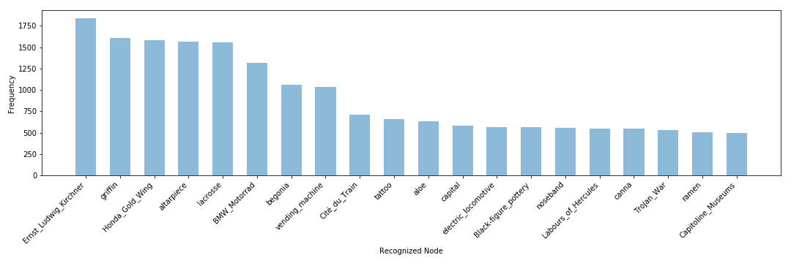

# Analysis of MSCOCO images with nodes from VisualSem
# Using 2048D representations and l1

## Top-N Frequency Plots

### Top-1

### Top-5

### Top-10

### Top-50

### Summary
As we can see from the above frequency plots, the more nodes we gather per image, the more the line becomes more horizontal instead of decreasing exponentially which is much more clearer here compared to cosine similarity. Seems to have correct concepts.

## Examples
To show whether the representations are useful and correct things can be recognized in an image, the MSCOCO images are shown with the recognized nodes in order.

### Example 1

COCO_train2014_000000046114.jpg

['radio', 'vending_machine', 'street_name', 'host', 'Sixth_generation_of_video_game_consoles', 'motherboard', 'central_processing_unit', 'shutter', 'GeForce', 'calculator', 'video_card', 'integrated_circuit', 'tape_recorder', 'Buenos_Aires_Underground', 'VCR', 'Nvidia', 'CPU_socket', 'door', 'Nokia', 'mixing_console', 'ink-jet_printer', 'pay-phone', 'gear', "Giotto's_Campanile", 'jukebox', 'Computer_cooling', 'transmission', 'receiver', 'microprocessor', 'air_conditioning', 'fixed_disk', 'typewriter', 'Jeep_Grand_Cherokee', 'memory', 'German_Papiermark', 'ghetto_blaster', 'smartphone', 'Music_sequencer', 'hand_truck', 'Smart_Fortwo', 'ATX_Power_Supply', 'compact_car', '135_film', 'Platform_display', 'arcade_game', 'History_of_computing_hardware', 'minivan', 'LCD', 'television_set', 'handbag']

### Example 2

COCO_train2014_000000211852.jpg

['red_squirrel', 'Highland_cattle', 'Hystricomorpha', 'orangutan', 'chicken_breed', 'red_panda', 'Ficus', 'Chamaecyparis_lawsoniana', 'Ranunculus', 'petroglyph', 'autumn', 'Nepenthes', 'moss', 'Old_World_monkey', 'aloe', 'Ericaceae', 'Mammal_classification', '2013_Pacific_typhoon_season', 'Claude_Monet', 'tree', 'chicken', 'Asiatic_lion', 'Castor_fiber', 'waterfall', 'eucalyptus', 'Teucrium', 'bryophyte', 'Orobanchaceae', 'salvia', 'epiphyte', 'wood', 'Bactrian_camel', 'Lepidium', 'lichen', 'Papaver', 'bark', 'Saxifraga', 'artemisia', 'guinea_pig', 'fern', 'stream', 'Carnivora', 'English_yew', 'cave', 'Cupressaceae', 'Vaccinium', 'Gentiana', 'lion', 'Thymus', 'begonia']

### Example 3

COCO_train2014_000000445140.jpg

['griffin', 'Descent_from_the_Cross', 'Ernst_Ludwig_Kirchner', 'The_Last_Judgment_(Michelangelo)', 'begonia', 'blazon', 'pretzel', 'food_fish', 'Saint_George', 'Greco-Buddhist_art', 'poinsettia', 'Christ_in_Majesty', 'danse_macabre', 'relief', 'Global_cuisine', 'Ricinus', 'Gymnadenia_conopsea', 'cattleya', 'Trojan_War', 'Sacra_conversazione', 'Greek_mythology', 'epiphyllum', 'myth', 'Holy_Roman_Empire', 'Buddha', 'Proteaceae', 'avatar', 'shellfish', 'caladium', 'heraldry', 'altarpiece', 'coronation', 'agate', 'Holy_Kinship', 'Henry_II', 'meat', 'capital', 'Ganesha', 'Issus', 'monster', 'Rosa_odorata', 'Duchy_of_Bavaria', 'rhododendron', 'Michelangelo', 'Gentianales', 'steak', 'ivy', 'satyr', 'Labours_of_Hercules', 'mineral']

### Example 4

COCO_train2014_000000574696.jpg

['Ernst_Ludwig_Kirchner', 'zebra', 'Byzantine_art', 'Equus_grevyi', 'Capitoline_Museums', 'Siberian_tiger', 'Trojan_War', 'Twelve_Olympians', 'Henry_Bolingbroke', 'Ancient_Greek_literature', 'Wassily_Kandinsky', 'Mary', 'iconography', 'King_of_Italy', 'Greek_mythology', 'Eastern_Orthodox_liturgical_calendar', 'Muse', 'Faiyum_portrait', 'God', 'icon', 'relief', 'House_of_Tudor', 'Latin_literature', 'Calendar_of_saints_(Lutheran)', 'Bengal_tiger', 'Henry_VIII', 'centaur', 'Athena', 'Proto-Cubism', 'Roman_sculpture', 'King_of_Jerusalem', 'Byzantine_dress', 'calico_cat', 'Paul', 'medicinal_plant', 'Monarchy_of_the_United_Kingdom', 'choli', 'Ancient_Greek_religion', 'cultural_depictions_of_Jesus', 'Philip_Augustus', 'Byzantine_Empire', 'Late_antiquity', 'Marian_feast_days', 'Horse_markings', 'tapestry', 'tattoo', 'International_Gothic', "Jami'al-tawarikh", 'John', 'Hathor']

### Summary
This clearly shows that things are recognized correctly for each of these images. This indicates that l1 is not always better in guessing concepts.

## Cosine Similarities
To see how the cosine similarities relate to each other in the top-Ns, we show some mean, median, variance and both min and max statistics. F stands for gathering all the similarities for that top and applying the statistics, whereas P calculates these statistics per image top and then averaging this.

<table border="1" class="dataframe">
  <thead>
    <tr style="text-align: right;">
      <th></th>
      <th>Mean F</th>
      <th>Median F</th>
      <th>Variance F</th>
      <th>Mean P</th>
      <th>Median P</th>
      <th>Variance P</th>
      <th>Min F</th>
      <th>Max F</th>
    </tr>
  </thead>
  <tbody>
    <tr>
      <th>Top-1</th>
      <td>0.000647</td>
      <td>0.000642</td>
      <td>3.071653e-09</td>
      <td>0.000647</td>
      <td>0.000647</td>
      <td>0.000000e+00</td>
      <td>0.000474</td>
      <td>0.000965</td>
    </tr>
    <tr>
      <th>Top-5</th>
      <td>0.000652</td>
      <td>0.000647</td>
      <td>3.214157e-09</td>
      <td>0.000652</td>
      <td>0.000653</td>
      <td>1.690044e-11</td>
      <td>0.000474</td>
      <td>0.001015</td>
    </tr>
    <tr>
      <th>Top-10</th>
      <td>0.000656</td>
      <td>0.000650</td>
      <td>3.299159e-09</td>
      <td>0.000656</td>
      <td>0.000657</td>
      <td>2.244215e-11</td>
      <td>0.000474</td>
      <td>0.001035</td>
    </tr>
    <tr>
      <th>Top-50</th>
      <td>0.000665</td>
      <td>0.000658</td>
      <td>3.539375e-09</td>
      <td>0.000665</td>
      <td>0.000666</td>
      <td>3.641711e-11</td>
      <td>0.000474</td>
      <td>0.001069</td>
    </tr>
  </tbody>
</table>

### Summary
What we can see, is that for all the tops, differences are very small, but maximum grows aswell as the variance.
