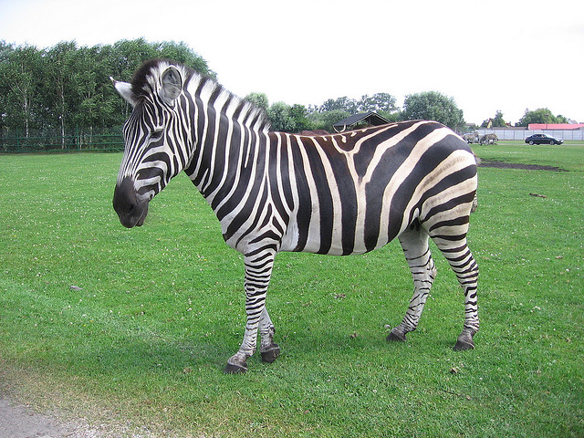

# Analysis of MSCOCO images with nodes from VisualSem
# Using 1000D representations and l2

## Top-N Frequency Plots

### Top-1

### Top-5

### Top-10

### Top-50

### Summary
As we can see from the above frequency plots, the more nodes we gather per image, the more the line becomes more horizontal instead of decreasing exponentially which is much more clearer here compared to cosine similarity. Seems to have correct concepts.

## Examples
To show whether the representations are useful and correct things can be recognized in an image, the MSCOCO images are shown with the recognized nodes in order.

### Example 1

COCO_train2014_000000046114.jpg

['MSX', 'stenograph', 'Электроника_МК-85', 'host', 'integrated_circuit', 'Nvidia', 'digital_computer', 'VAX', 'Motorola_68000', 'stereoscopy', 'TRS-80', 'LGA_775', 'GeForce_6_series', 'Macintosh', 'Mixed_reality', 'metallophone', 'jukebox', 'chest_of_drawers', 'sound_card', 'plug-in', 'barnstar', 'VGA', 'PC_board', 'heart-lung_machine', 'video_card', 'police_box', 'offset', 'BIOS', 'Guitar_amplifier', 'Computer_cooling', 'AMD_Athlon_XP', 'autopilot', 'IBM_System_i', 'Linotype', 'cube', 'ILiad', 'Windows_Aero', 'disk_controller', 'Parallel_ATA', 'Zilog_Z80', 'central_processing_unit', 'galley', 'ARP_2600', 'cardboard', 'UNIX_System_V', 'rocking_chair', 'Teleprompter', 'EPROM', 'cabinet', 'flight_simulator']

### Example 2

COCO_train2014_000000211852.jpg

['Bornean_slow_loris', 'offspring', 'Horse_markings', 'Mare_milk', 'hackamore', 'working_dog', 'Lassie', 'pet', 'Lossy_compression', 'hair', 'tapetum_lucidum', 'puppy', 'Cruelty_to_animals', 'American_Eskimo_Dog', 'meow', 'Falabella', 'stallion', 'Japanese_wolf', 'sable', 'yawn', 'dairy_cattle', 'Siamese_cat', 'tack', '1798', 'Ragdoll', 'street_dog_in_Moscow', 'police_dog', 'bridle', 'Turkish_Van', 'cat', 'purebred', 'Thai', 'Dog_harness', 'Hachikō', 'Birman', 'noseband', 'rump', '-voro', 'Tsavo_Man-Eaters', 'Dog_fighting', 'Oliver_Heaviside', 'Samoyed', '1878', 'Hanoverian_horse', 'cat_breed', 'Governor_of_British_Ceylon', '1876', "Athletics_at_the_1932_Summer_Olympics_–Men's_400_metres_hurdles", 'fancy_rat', 'Brigham_Young']

### Example 3

COCO_train2014_000000445140.jpg

['Gulai', 'lentil', 'Pterospermum_acerifolium', 'sanguine', 'The_Last_Judgment_(Michelangelo)', 'giant_clam', "Clark's_anemonefish", 'Ocellaris_clownfish', 'anemone_fish', 'Pig_slaughter', 'ear_fungus', 'Crested_bullhead_shark', 'Acanthurus', 'Mytilidae', 'Maroon_clownfish', 'Gray_angelfish', 'abrasion', 'Amphiprion_percula', 'Xanthidae', 'Rock_art', 'Siren', 'courtship', 'Akwa_Ibom_State', 'hemorrhoid', 'Judgement_of_Paris', 'flying_gurnard', 'Metatron', 'Beadlet_anemone', 'escapism', 'Meatball_soup', 'surgeonfish', 'Melonpan', 'Paracanthurus', 'Campsis_radicans', 'Siebenrockiella', 'Basbousa', 'Psilocybe_zapotecorum', 'Cinnamon_clownfish', 'Agaricales', 'Rock_Carvings_in_Tanum', 'Boletus_pulverulentus', 'snorkel', 'sea_slug', 'colonoscopy', 'EPP', 'Sexual_fantasy', 'hero', 'Eriophyes_tiliae', 'Bubble_nest', 'Bahram_Vallis']

### Example 4

COCO_train2014_000000574696.jpg

['sidesaddle', 'Yadi', 'tack', 'bridle', 'saddle_seat', 'headstall', 'noseband', 'pitcher', 'Rollkur', 'habit', 'saddle_blanket', 'Baseball_uniform', 'dressage', 'Siuda_Baba', 'Horse_collar', 'Yang_Guifei', 'catcher', 'Out_(baseball)', 'Penalty_(gridiron_football)', 'Highland_dress', 'tackle', 'Kazuhiro_Sasaki', 'equitation', 'Sliding_tackle', "Athletics_at_the_1912_Summer_Olympics_–Men's_triple_jump", 'Pareo', 'chaps', 'fullback', 'switch-hitter', 'loincloth', 'cheerleader', 'rein', 'Athletics_at_the_1924_Summer_Olympics', 'hackamore', 'quarterback', 'Banyarwanda', 'Albanian_folk_costume', 'Apollo_Belvedere', 'gambeson', 'Military_tribune', 'Greek_dress', 'tricorne', 'Tswana', 'Classification_of_indigenous_peoples_of_the_Americas', 'fustanella', 'Iowa', 'Hanoverian_horse', 'Bianca_Maria_Sforza', 'Folk_costume', 'Horse_harness']

### Summary
Not great, but okay

## Cosine Similarities
To see how the cosine similarities relate to each other in the top-Ns, we show some mean, median, variance and both min and max statistics. F stands for gathering all the similarities for that top and applying the statistics, whereas P calculates these statistics per image top and then averaging this.

<table border="1" class="dataframe">
  <thead>
    <tr style="text-align: right;">
      <th></th>
      <th>Mean F</th>
      <th>Median F</th>
      <th>Variance F</th>
      <th>Mean P</th>
      <th>Median P</th>
      <th>Variance P</th>
      <th>Min F</th>
      <th>Max F</th>
    </tr>
  </thead>
  <tbody>
    <tr>
      <th>Top-1</th>
      <td>2.344244</td>
      <td>2.297840</td>
      <td>0.078803</td>
      <td>2.344244</td>
      <td>2.344244</td>
      <td>0.000000</td>
      <td>1.669469</td>
      <td>4.186771</td>
    </tr>
    <tr>
      <th>Top-5</th>
      <td>2.381850</td>
      <td>2.332909</td>
      <td>0.084588</td>
      <td>2.381850</td>
      <td>2.387615</td>
      <td>0.000774</td>
      <td>1.669469</td>
      <td>4.350179</td>
    </tr>
    <tr>
      <th>Top-10</th>
      <td>2.403007</td>
      <td>2.352295</td>
      <td>0.088083</td>
      <td>2.403007</td>
      <td>2.410214</td>
      <td>0.001000</td>
      <td>1.669469</td>
      <td>4.388596</td>
    </tr>
    <tr>
      <th>Top-50</th>
      <td>2.462447</td>
      <td>2.407291</td>
      <td>0.098418</td>
      <td>2.462447</td>
      <td>2.472500</td>
      <td>0.001600</td>
      <td>1.669469</td>
      <td>4.574465</td>
    </tr>
  </tbody>
</table>

### Summary
What we can see, is that for all the tops, we get larger variances over more concepts, whereas the difference between the minimum and maximum becomes slightly larger. 
